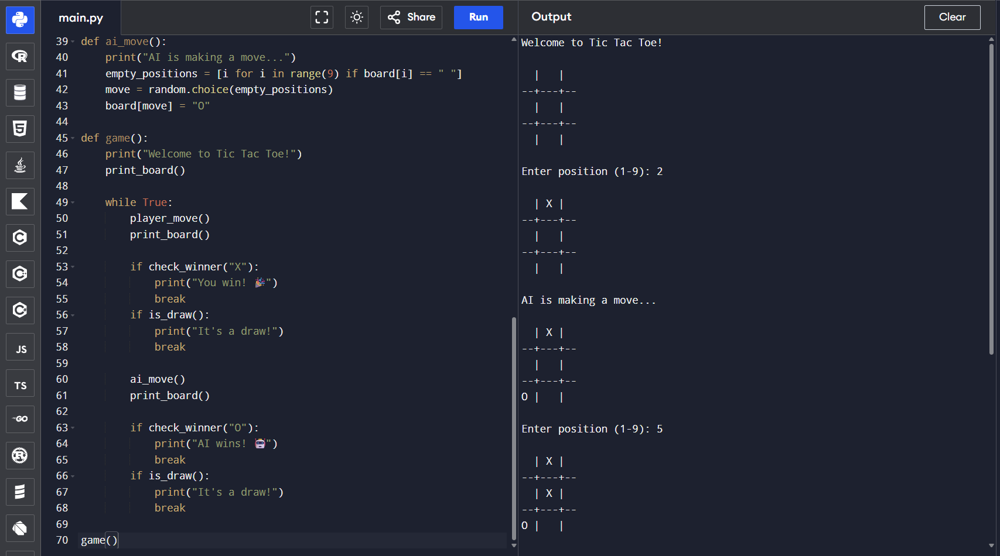
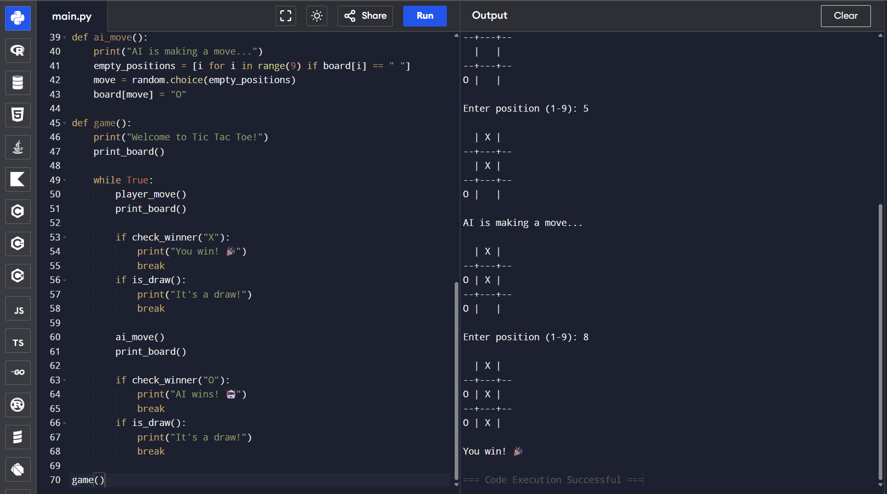

# CODSOFT---Tic-Tac-Toe-AI-Task-2-
This project is created for CODSOFT AI Internship Task 2. It is a simple Tic Tac Toe game where a human player plays against an AI. The AI makes automatic moves based on available positions on the board.
## 📸 Output Screenshots

### ▶ Game Start

### ▶ Game Play

